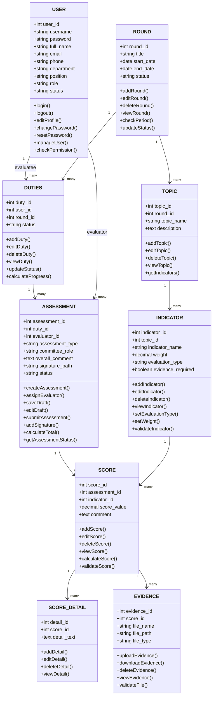

# Class Diagram (9 คลาสหลัก)

```mermaid
classDiagram
class USER {
  +int user_id
  +string username
  +string password
  +string full_name
  +string email
  +string phone
  +string department
  +string position
  +string role
  +string status
  +login()
  +logout()
  +editProfile()
  +changePassword()
  +resetPassword()
  +manageUser()
  +checkPermission()
}
class ROUND {
  +int round_id
  +string title
  +date start_date
  +date end_date
  +string status
  +addRound()
  +editRound()
  +deleteRound()
  +viewRound()
  +checkPeriod()
  +updateStatus()
}
class TOPIC {
  +int topic_id
  +int round_id
  +string topic_name
  +text description
  +addTopic()
  +editTopic()
  +deleteTopic()
  +viewTopic()
  +getIndicators()
}
class DUTIES {
  +int duty_id
  +int user_id
  +int round_id
  +string status
  +addDuty()
  +editDuty()
  +deleteDuty()
  +viewDuty()
  +updateStatus()
  +calculateProgress()
}
class INDICATOR {
  +int indicator_id
  +int topic_id
  +string indicator_name
  +decimal weight
  +string evaluation_type
  +boolean evidence_required
  +addIndicator()
  +editIndicator()
  +deleteIndicator()
  +viewIndicator()
  +setEvaluationType()
  +setWeight()
  +validateIndicator()
}
class ASSESSMENT {
  +int assessment_id
  +int duty_id
  +int evaluator_id
  +string assessment_type
  +string committee_role
  +text overall_comment
  +string signature_path
  +string status
  +createAssessment()
  +assignEvaluator()
  +saveDraft()
  +editDraft()
  +submitAssessment()
  +addSignature()
  +calculateTotal()
  +getAssessmentStatus()
}
class SCORE {
  +int score_id
  +int assessment_id
  +int indicator_id
  +decimal score_value
  +text comment
  +addScore()
  +editScore()
  +deleteScore()
  +viewScore()
  +calculateScore()
  +validateScore()
}
class SCORE_DETAIL {
  +int detail_id
  +int score_id
  +text detail_text
  +addDetail()
  +editDetail()
  +deleteDetail()
  +viewDetail()
}
class EVIDENCE {
  +int evidence_id
  +int score_id
  +string file_name
  +string file_path
  +string file_type
  +uploadEvidence()
  +downloadEvidence()
  +deleteEvidence()
  +viewEvidence()
  +validateFile()
}
USER "1" --> "many" DUTIES : evaluatee
ROUND "1" --> "many" TOPIC
ROUND "1" --> "many" DUTIES
TOPIC "1" --> "many" INDICATOR
DUTIES "1" --> "many" ASSESSMENT
USER "1" --> "many" ASSESSMENT : evaluator
ASSESSMENT "1" --> "many" SCORE
INDICATOR "1" --> "many" SCORE
SCORE "1" --> "many" SCORE_DETAIL
SCORE "1" --> "many" EVIDENCE
```

หมายเหตุ: Methods เป็นพฤติกรรมของคลาส ไม่ใช่คอลัมน์ในฐานข้อมูล; Attributes อ้างอิงโครงสร้างข้อมูลใน `database/schema.sql`.
