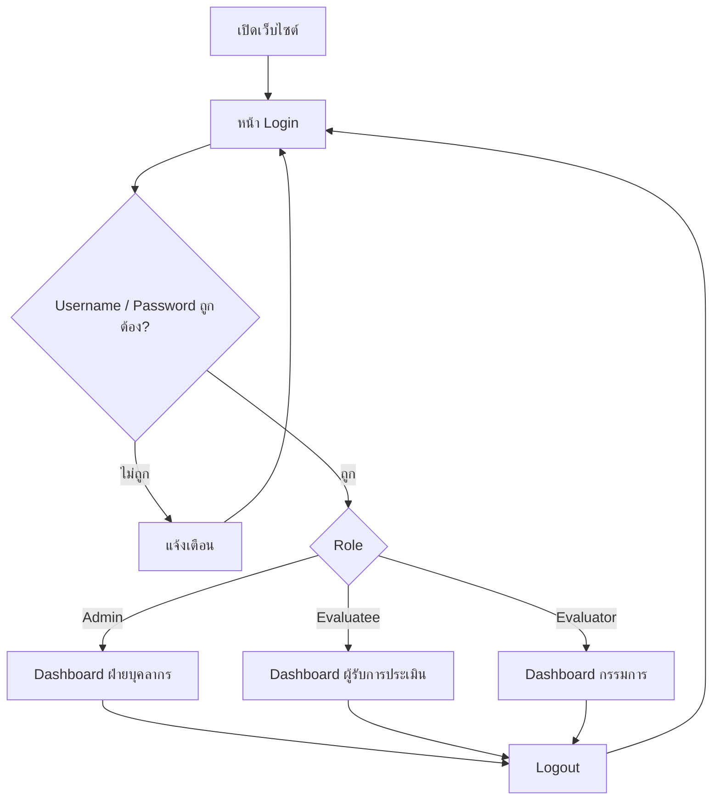
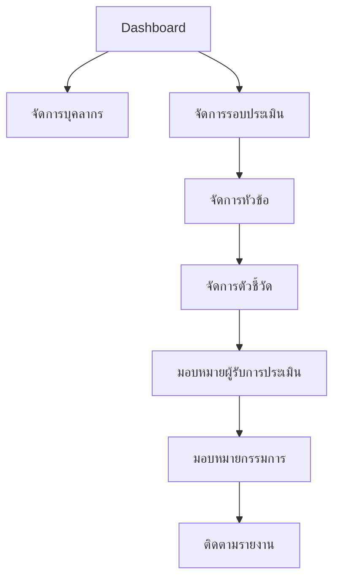
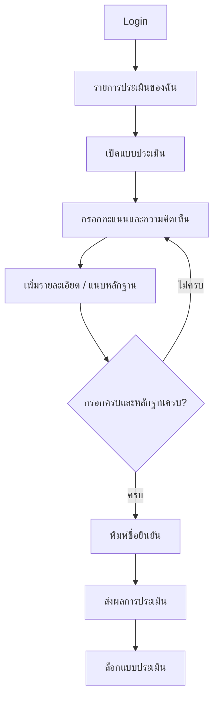

# System Flows

## Login

```mermaid
flowchart TD
 A[เปิดเว็บไซต์] --> B[หน้า Login]
 B --> C{Username / Password ถูกต้อง?}
 C -- ไม่ถูก --> D[แจ้งเตือน]
 D --> B
 C -- ถูก --> E{Role}
 E -- Admin --> F[Dashboard ฝ่ายบุคลากร]
 E -- Evaluatee --> G[Dashboard ผู้รับการประเมิน]
 E -- Evaluator --> H[Dashboard กรรมการ]
 F --> I[Logout]
 G --> I
 H --> I
 I --> B
```

## Admin

```mermaid
flowchart TD
 A[Dashboard] --> B[จัดการบุคลากร]
 A --> C[จัดการรอบประเมิน]
 C --> D[จัดการหัวข้อ]
 D --> E[จัดการตัวชี้วัด]
 E --> F[มอบหมายผู้รับการประเมิน]
 F --> G[มอบหมายกรรมการ]
 G --> H[ติดตามรายงาน]
```

## Evaluatee / Evaluator

```mermaid
flowchart TD
 A[Login] --> B[รายการประเมินของฉัน]
 B --> C[เปิดแบบประเมิน]
 C --> D[กรอกคะแนนและความคิดเห็น]
 D --> E[เพิ่มรายละเอียด / แนบหลักฐาน]
 E --> F{กรอกครบและหลักฐานครบ?}
 F -- ไม่ครบ --> D
 F -- ครบ --> G[พิมพ์ชื่อยืนยัน]
 G --> H[ส่งผลการประเมิน]
 H --> I[ล็อกแบบประเมิน]
```
